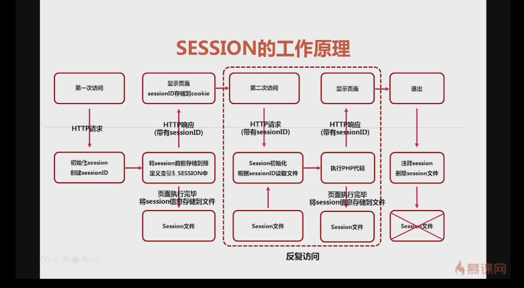

> Session support in PHP consists of a way to preserve certain data across subsequent accesses. This enables you to build more customized applications and increase the appeal of your web site

## Related Functions

- `session_start` - bool session_start ([ array $options = array() ] ) -> session_start() creates a session or resumes the current one based on a session identifier passed via a GET or POST request, or passed via a cookie.

